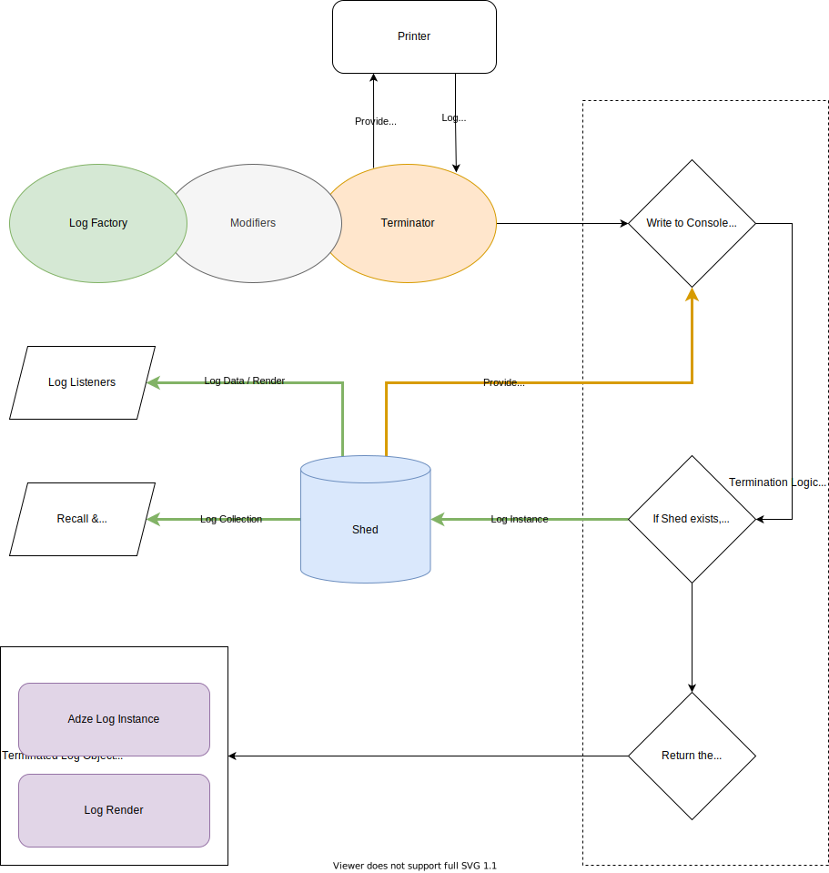

# Adze Concepts

Adze as a library has a couple of core goals it attempts to meet. The first goal
is to provide an API that wraps, extends, or replicates all of the functionality
of the standard [Console API](https://developer.mozilla.org/en-US/docs/Web/API/console).

The second goal of the Adze project is to give you a natural log writing experience
that doesn't feel too different from the standard. To make the experience of using Adze feel
natural, Adze provides a chainable API that is similar to the standard `console.log()` API.

## Lifecycle

Let's take a look under the hood to see how the Adze architecture enables its API.
_Please keep in mind this diagram is not exhaustive._



## The Log Chain

As you can see in the diagram, a log chain is made up of three parts:

- [Log Factory](factories.md)
  - This is a function that generates a log instance and returns it.
- [Modifiers](modifiers.md)
  - These log methods modify the instance and then return it.
- [Terminator](default-terminators.md)
  - These methods end the chain and finalize the log.

### Log Factory

Adze comes with a function named [`adze()`](factories.md#adze) out of the box. This function is
a [factory](factories.md) that creates a new Adze instance. Most of the time when interacting
with this library you will either use this factory directly or assign it to
a variable after calling [seal](factories.md#seal), but we'll come back to that later in the guide.

### Modifiers

Once you have an instance of Adze you can immediately [terminate](terminators) it, or you
can call certain methods that this library calls modifiers. Modifiers are
methods on an Adze log instance that changes its behavior. For example, if
you wanted to add a performance timestamp to your log you would use the
`timeNow` modifier.

```typescript
adze().timeNow.log('This log is being counted!');
```

And it would output like this:


### Terminator

In our [Modifiers](modifiers) example code above, you can see we ended our
chain with [`log()`](default-terminators.md#log). The log method is one of the eight [default log terminators](default-terminators.md).
The library also comes with [other special terminators](other-terminators.md) like
[custom](other-terminators.md#custom). A log method is considered a terminator when it
ends your log chain and returns a [terminated log object](data.md#terminated-log-object).

## Common Usage

Most of the time when you are using a logging library you will want to configure an logging instance once and then use it throughout your codebase. This is done with the [seal factory](factories.md#seal). Once your configuration is sealed,

### Example

```javascript
// ----- setup.js ----- //
import { adze, createShed } from 'adze';

/* We'll create a Shed to enable labels and counting
   for our example. */
createShed();

// Let's create an Adze configuration
const cfg = {
  log_level: 1,
};

// Now we'll create a new factory using seal
export const log = adze(cfg).label('foo').count.seal();

// ----- elsewhere.js ----- //
import { log } from '~/setup.ts';

// And now we can create new logs using our new factory
log().error('An error occurred! Oh no!');
log().error('Another error occurred! Quick! Help!');
log().log("I won't display because my log level is too high.");
```

### Output


