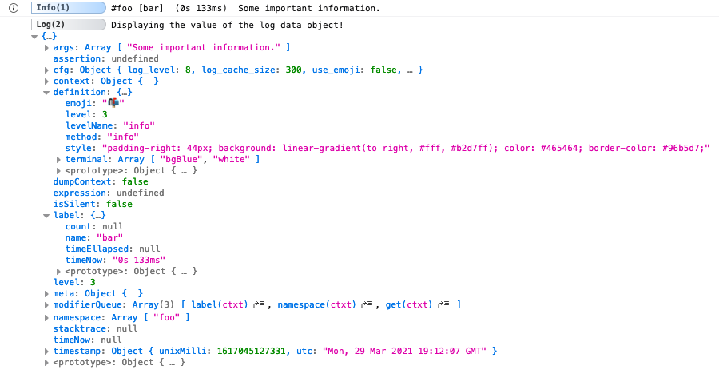
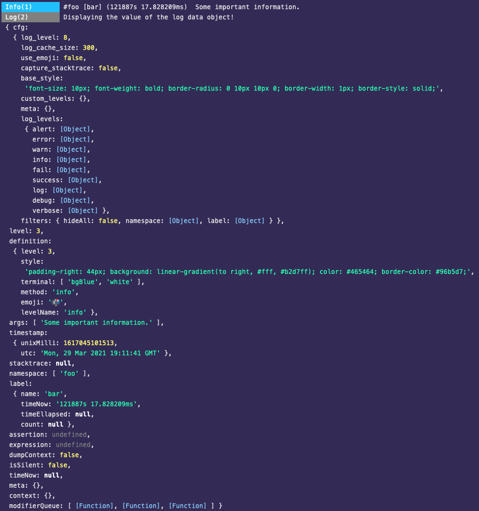

# Data

In this section of the guide we'll take a look at some of the important data structures that exist across the Adze API.

## Collections

A Collection is simply an array of Adze log instances that extend from the **BaseLog** class. There are two types of instances that extend BaseLog, **BundledLog** and **Log**. You will never interact with a **BaseLog** instance directly.

A **Log** is the instance type that is created whenever you normally terminate a log.

A **BundledLog** is a log instance that is generated from a [bundle](factories.md#bundle) factory. These log instances have a getter that allows you to access the log bundle.

Collections are typically used in conjunction with filter functions like [filterNamespace](filtering-and-utility-functions.md#filternamespace), [filterLabel](filtering-and-utility-functions.md#filterlabel), [filterLevel](filtering-and-utility-functions.md#filterlevel), and [filterCollection](filtering-and-utility-functions.md#filtercollection).

### Interface

```typescript
type Collection = BaseLog[];
```

### Bundle Example

```javascript
import { adze, createShed } from 'adze';

// Let's create a log bundle
const bundled = bundle(adze({ use_emoji: true }));

bundled().label('collect').error('This is an error!');
bundled().label('collect').info('A bundled log with namespaces.');
bundled().label('collect').success('Successfully bundled this log!');
const { log } = bundled().label('collect').log('Another log in the bundle.');

// Let's get our Collection from our bundle
const collection = log.bundle;
```

### Shed Example

```javascript
import { adze, createShed } from 'adze';

// We'll create a Shed to capture our logs
const shed = createShed();

// Let's get our collection from the Shed
const collection = shed.getCollection();
```

## Label Data Object

A label data object is generated from a label instance. This object contains data that from globally tracked [counters](modifiers.md#count), [timers](modifiers.md#time), and [MDC context](other-terminators.md#thread).

### Interface

```typescript
interface LabelData {
  name: string | null;
  timeNow: string | null;
  timeEllapsed: string | null;
  count: number | null;
}
```

## Level Filter

A level filter type is a value that represents one or more log levels. It is in the form of an array of numbers that represent selected log levels or a string that represents a range of levels or all levels.

### Example

_NOTE:_ This is not the recommended way of doing this. Please refer to [render](filtering-and-utility-functions.md#render).

```javascript
import { adze } from 'adze';

// Let's generate a log and get its render
const { render } = adze().info('This is an info log');

// Then we will destructure the log to get the method and arguments
const [method, args] = render;

/* And now we can re-render the log by calling the
   console method and spreading the args */
console[method](...args);
```

### Output


## Log Data

The log data object contains all of the important meta data from a log's instance. The log data object is used throughout the Adze API. For example, when a [log listener](using-shed.md#addlistener) on a [Shed](shed-concepts.md) is fired, the callback function will be invoked with two parameters; the **log data object** and a [log render](adze-concepts.md#logrender).

A log data object can be manually retrieved from a log instance using the [data getter](getters-and-setters.md#data).

A log data object can also be used to create a clone of a log by [hydrating](getters-and-setters.md#hydrate) a new log instance from the log data object.

Final log data extends log data and changes the possible values of some properties. Certain methods require final log data to be provided to it. Use the [isFinalLogData](filtering-and-utility-functions.md#isfinallogdata) type guard to verify it.

### Interface

```typescript
// The log data object's interface
interface LogData {
  args: unknown[] | null;
  assertion?: boolean;
  cfg: Defaults;
  context: MetaData;
  definition: LogLevelDefinition | null;
  dumpContext: boolean;
  expression?: boolean;
  isSilent: boolean;
  label: LabelData;
  level: number | null;
  meta: MetaData;
  modifierQueue: Array<(ctxt: BaseLog) => void>;
  namespace: string[] | null;
  stacktrace: string | null;
  timeNow: string | null;
  timestamp: LogTimestamp | null;
}

// This is the definition for log meta data after termination
interface FinalLogData extends LogData {
  level: number;
  definition: LogLevelDefinition;
  args: unknown[];
  timestamp: LogTimestamp;
}
```

### Property Descriptions

| Name          | Description                                                                                  | Documentation                                                    |
| ------------- | -------------------------------------------------------------------------------------------- | ---------------------------------------------------------------- |
| args          | Arguments provided to the log instance.                                                      | -                                                                |
| assertion     | The boolean result of the assertion expression on the log instance.                          | [assert](modifiers.md#assert)                                    |
| cfg           | The configuration of the instance.                                                           | [Config](/config/#adze-configuration)                            |
| context       | The context value of an MDC thread.                                                          | [MDC](mapped-diagnostic-context.md)                              |
| definition    | Configuration of the log level of the instance.                                              | [Log Level Definition](/config/#log-levels-log-level-definition) |
| dumpContext   | Boolean indicating if the mapped diagnostic context (MDC) should be rendered.                | [MDC](mapped-diagnostic-context.md)                              |
| expression    | The boolean result of the test expression on the log instance.                               | [test](modifiers.md#test)                                        |
| isSilent      | Boolean value indicating if the log should execute silently.                                 | [silent](modifiers.md#silent)                                    |
| label         | The values of a label instance attached to the log instance.                                 | [Label](#label-data-object)                                      |
| level         | The log level of the instance.                                                               | [Log Level Definition](/config/#log-levels-log-level-definition) |
| meta          | Meta data attached to the instance.                                                          | [meta](modifiers.md#meta)                                        |
| modifierQueue | The queue of modifiers that will be executed against the log instance when it is terminated. | -                                                                |
| namespace     | Array of namespaces associate to the log instance.                                           | [namespace / ns](modifiers.md#namespace-ns)                      |
| stacktrace    | A stringified stacktrace that leads up to when the log instance was created.                 | [Config](/config/#adze-configuration)                            |
| timeNow       | The timestamp from executing a timeNow modifier.                                             | [timeNow](modifiers.md#timenow)                                  |
| timestamp     | Object containing time signatures of when the log instance was created.                      | [Log Timestamp](#log-timestamp)                                  |

### Example

```javascript
import { adze } from 'adze';

// Let's create a log instance with some various properties
const { log } = adze()
  .ns('foo')
  .label('bar')
  .timeNow.info('Some important information.');

// Let's get the log data by using the data getter on the instance
const data = log.data;

adze().log('Displaying the value of the log data object!', data);
```

### Output





## Log Render

A log render is returned as a sub-property of a [terminated log object](#terminated-log-object). The log render is a tuple in the form of `[method, args]` that you can use to [re-render](filtering-and-utility-functions.md#rerender) your log exactly how the Adze log instance rendered it. Here is an example of how [render](filtering-and-utility-functions.md#render) a log using a log render:

### Manual Example

_NOTE:_ This is not the recommended way of doing this. Please refer to [render](filtering-and-utility-functions.md#render).

```javascript
import { adze } from 'adze';

// Let's generate a log and get its render
const { render } = adze().info('This is an info log');

// Then we will destructure the log to get the method and arguments
const [method, args] = render;

/* And now we can re-render the log by calling the
   console method and spreading the args */
console[method](...args);
```

### Output


## Log Timestamp

The log timestamp data object contains two equivalent timestamp values for use of knowing when the log instance was terminated.

### Interface

```typescript
interface LogTimestamp {
  unixMilli: number;
  utc: string;
}
```

### Example

```javascript
import { adze, createShed } from 'adze';

// Let's generate a log and get its instance
const { log } = adze().info('This is an info log');

// Now let's export its meta data and select the timestamp data object
const timestamp = log.data.timestamp;
// => { unixMilli: 1617827970649, utc: 'Wed, 07 Apr 2021 20:39:30 GMT' }
```

## Terminated Log Object

After an Adze log has been terminated a **Terminated Log object** will be returned (with a couple of exceptions, like [clear](other-terminators.md#clear-clr)). A terminated log object consists of two parts, the **Log Instance** and the [Log Render](#log-render).

The log instance is the reference to the instance that was terminated. You can use this to get [meta data about the Log](#log-data) or get a [collection](#collection) of logs if the log was [bundled](factories.md#bundle).

### Interface

```typescript
interface TerminatedLog<T extends BaseLog> {
  log: T;
  render: LogRender | null;
}
```
