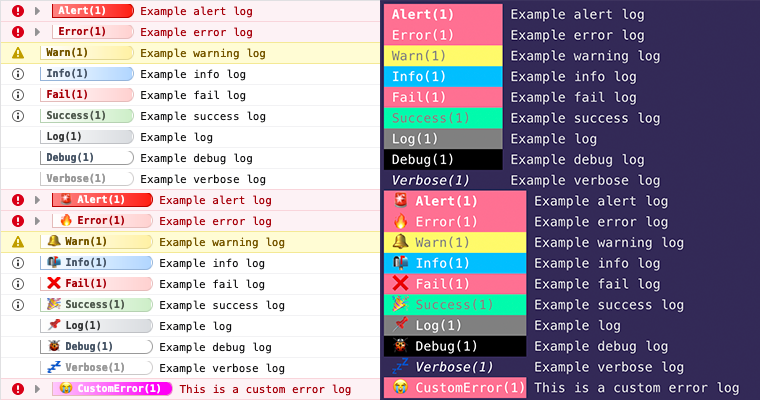

# Adze


[](https://github.com/AJStacy/adze/actions/workflows/build.yml)
  [](https://bundlephobia.com/result?p=adze@0.5.3) [](https://bundlephobia.com/result?p=adze@0.5.3) [](/LICENSE.md)

**Please visit our official docs at [adzejs.com](http://www.adzejs.com/).**

## Why is this named Adze?


_Photo from [Wikipedia](https://en.wikipedia.org/wiki/Adze)_

> Adze - [a cutting tool that ... is used chiefly for shaping wood](https://www.merriam-webster.com/dictionary/adze).

Adze was chosen as a name for this library to maintain solidarity with the logging puns and to emphasize that this library is a tool for shaping the logs of your application.

## Why should I use Adze?

As you may already be aware there are a number of other good JS libraries out there to assist with logging. The focus of Adze is to provide a convenient and clean API, provide first-class TypeScript support, and to empower you to take command of your logs rather than pigeon-hole you into a specific way of handling them.

Here is a list of the features that Adze provides:

- First-class TypeScript support
- Runs in both the browser and node
- A fluent, chainable API for creating logs
- Log Listeners that empower you to do with your logs as you wish
- Annotate your logs with namespaces, labels, and other meta data
- Attractive styling (EMOJI'S INCLUDED and consistent across major browsers)
- Everything is configurable
- Create custom log levels
- A global log store for recalling logs and overriding configuration
- and much more...

Beyond the new features that Adze provides you, it also wraps the entire console web standard.
Read more about the standard here: [MDN Console Docs](https://developer.mozilla.org/en-US/docs/Web/API/console)

### Here is a simple preview:



> This preview was generated from the same code executed in both the browser (left) and the node (right) environments.

## What does the API look like?

As stated above, Adze offers an easy to use, chainable API. To create a log you simply chain together an Adze log instance with a series of modifiers and then end with a terminator. Here's an example of creating a log with emoji's and a namespace:

```typescript
import { adze } from 'adze';

adze({ use_emoji: true }).ns('tix-456').log('Example log');
```

The output of this would look like the following:


## Install the Package

You can install Adze from NPM using the following command:

```bash
# NPM
npm install --save adze

# Yarn
yarn add adze
```

## Version Requirements

| Dependency | Supported Versions | Notes                                    |
| ---------- | ------------------ | ---------------------------------------- |
| node       | >= 10.x            | When running Adze in a Node environment. |
| typescript | >= 4.1             | When using Adze with TypeScript          |

## TypeScript Configuration

Adze is built to be used with TypeScript and we highly encourage using it in this way.

When building your project with TypeScript, you need to make sure you use the `"DOM"` lib because Adze supports both the web browser and Node.

For more information about configuring TypeScript, go to [https://www.typescriptlang.org/docs/handbook/tsconfig-json.html](https://www.typescriptlang.org/docs/handbook/tsconfig-json.html).

### Example

```json
{
  "compilerOptions": {
    // ...your other options
    "lib": ["DOM"]
  }
}
```

## Importing Adze

Adze comes bundled with a few different ways of accessing it. Here are some examples:

### CDN

You can import the library directly into your HTML from the [jsDelivr](https://www.jsdelivr.com/package/npm/adze) CDN.

_**NOTE:** In the script tag in the example below, replace `<version>` with the version of Adze you would like to use._

```html
<!-- In the head of your html -->
<head>
  <!-- To use v0.5.3 you would write https://cdn.jsdelivr.net/npm/adze@0.5.3/dist/adze.min.js -->
  <script src="https://cdn.jsdelivr.net/npm/adze@<version>/dist/adze.min.js"></script>
</head>

<!-- Using adze elsewhere in JS -->
<script>
  // Adze is registered globally in your browser as AdzeLib
  const { adze } = AdzeLib;

  adze().log('Hello World!');
</script>
```

### Node JS (CommonJS)

```javascript
const { adze } = require('adze');

adze().log('Hello World!');
```

### ES6 / TypeScript

```typescript
import { adze } from 'adze';

adze().log('Hello World!');
```

## Documentation

**Please visit our official docs at [adzejs.com](http://www.adzejs.com/).**
